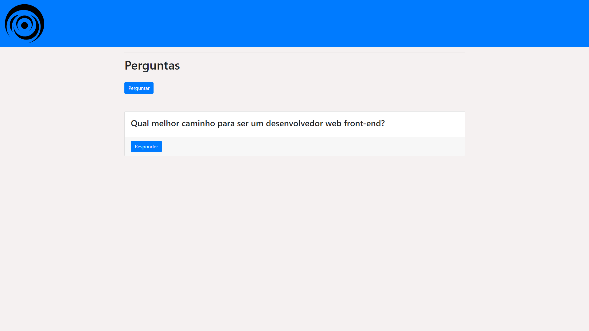

# Guia-perguntas

Projeto parecido com Yahoo resposta (Node.js + MySQL + EJS)

# Recursos

* O aplicativo foi desenvolvido com JavaScrip, CSS, HTML, EJS, MySQL e Express.js.

# Uso

1. Clone o repositório do GitHub.
2. Abra o projeto no seu editor de código.
3. Instale o pacote do projeto com npm install(É necessário MySQL instalado).
4. Inicie o MySQL Workbench.
5. Depois de instalado os pacotes, basta dar um npm start para iniciar o projeto na porta localhost:3003.

# Créditos

Este projeto foi criado por Alaska Websites.